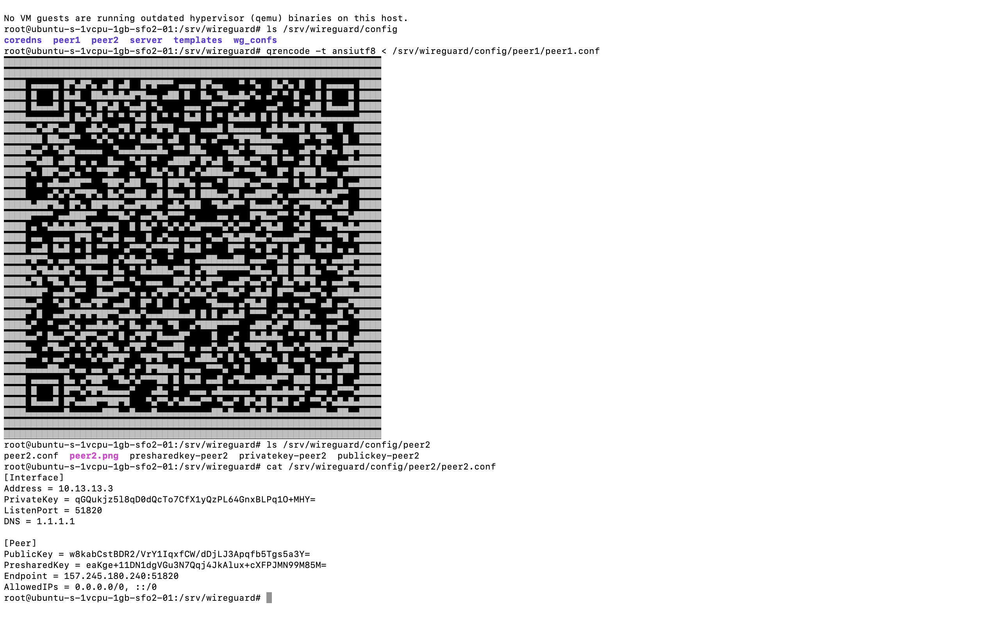
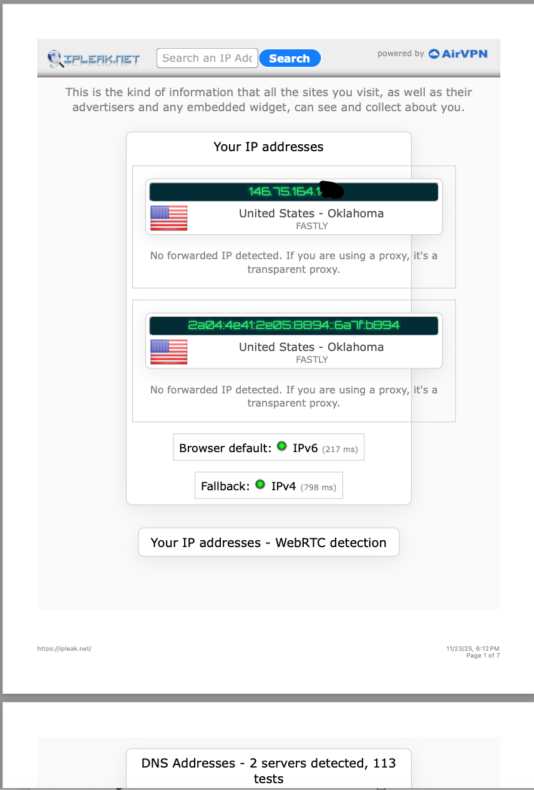
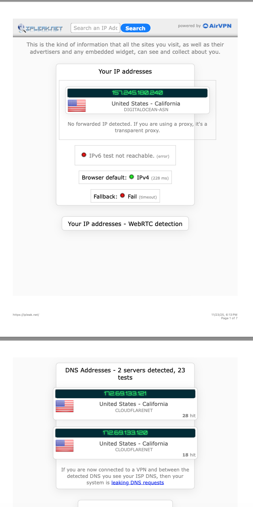

Author: Alexandra Hernandez Gomez

Revision Date: November 23, 2025

What: This documentation explains the process of setting up a WireGuard VPN server using Docker on a DigitalOcean Ubuntu droplet and testing the VPN on mobile and laptop devices.

Step 1 — Sign Up for DigitalOcean
I created a DigitalOcean account and redeemed the free credit offered to students. This credit allows the server (Droplet) to run with no out-of-pocket cost.

Link:

https://www.digitalocean.com/?refcode=d33d59113ab6&utm_campaign=Referral_Invite&utm_medium=Referral_Program&utm_source=CopyPaste

Step 2 — Create a DigitalOcean Droplet

2.1 Start Droplet Creation

        Inside DigitalOcean → click Create → Droplets.

        Selected Ubuntu 24.04 LTS

        Chose the $6/month Basic Droplet (2nd cheapest option)

        Droplet Type: Basic

        CPU Type: Regular (SSD)

        Disk Type: Normal SSD

        RAM: 1 GB

        vCPU: 1

        Storage: 25 GB SSD

        Authentication Method: Password

        Chose Datacenter Region: San Francisco (SFO2) 

Left all optional add-ons as default

        Clicke Create Droplet

Step 3 — Install Docker

These install steps are executed on the Ubuntu 24.04 LTS droplet. They follow the official Docker Engine documentation: https://docs.docker.com/engine/install/ubuntu/

3.1 Connect to the Droplet

Open a terminal on your Mac 

        ssh root@<your-droplet-ip>

3.2 Update System

        apt update
        apt upgrade -y

3.3 Install Dependencies

        apt install ca-certificates curl gnupg -y

3.4 Add Docker’s GPG Key

        install -m 0755 -d /etc/apt/keyrings

        curl -fsSL https://download.docker.com/linux/ubuntu/gpg | gpg --dearmor -o /etc/apt/keyrings/docker.gpg

        chmod a+r /etc/apt/keyrings/docker.gpg

3.5 Add Docker Repository

        echo \
        "deb [arch=$(dpkg --print-architecture) signed-by=/etc/apt/keyrings/docker.gpg] https://download.docker.com/linux/ubuntu \
        $(. /etc/os-release && echo "$VERSION_CODENAME") stable" \
        | tee /etc/apt/sources.list.d/docker.list > /dev/null

3.6 Install Docker Engine + Compose

        apt update
        apt install docker-ce docker-ce-cli containerd.io docker-buildx-plugin docker-compose-plugin -y

3.7 Verify Docker Works

        docker --version
        docker ps

Should show Docker version and no containers running.

Step 4 — Install WireGuard 

Official documentation used:
 https://docs.linuxserver.io/images/docker-wireguard

4.1 Create WireGuard Directory

        mkdir -p /srv/wireguard
        cd /srv/wireguard

4.2 Create docker-compose.yml

        nano docker-compose.yml

        Paste:
        version: "2.1"
        services:
        wireguard:
            image: lscr.io/linuxserver/wireguard:latest
            container_name: wireguard
            cap_add:
            - NET_ADMIN
            - SYS_MODULE
            environment:
            - PUID=0
            - PGID=0
            - TZ=America/Chicago
            - SERVERURL=157.245.180.240
            - SERVERPORT=51820
            - PEERS=2
            - PEERDNS=1.1.1.1
            volumes:
            - ./config:/config
            - /lib/modules:/lib/modules
            ports:
            - 51820:51820/udp
            sysctls:
            - net.ipv4.conf.all.src_valid_mark=1
            restart: unless-stopped

        Save + exit:
       
4.3 Start WireGuard

        docker compose up -d

4.4 Check WireGuard Container

        docker ps

Should output:

wireguard container

Port 51820/udp

Status: Up

Step 5A — Test VPN on a Mobile Device

5A.1 Install WireGuard App

    Installed from Apple App Store on iPhone.

5A.2 Generate QR Code for Peer1

    qrencode -t ansiutf8 < /srv/wireguard/config/peer1/peer1.conf

WireGuard app → Add Tunnel → Scan QR Code

5A.3 BEFORE VPN — IP & DNS

                Visited: https://ipleak.net

5A.4 Activate the Tunnel

        Turned on the imported WireGuard tunnel.

 WireGuard app showed:

Status: Connected

                Visited: https://ipleak.net again.

From the “AFTER” PDF:

Step 5B — Laptop VPN Test

I attempted to install WireGuard on my Mac (macOS 13.7), but I was unable to complete the setup because of several issues:

The App Store version would not install.
 I am locked out of the iCloud account that is signed into this Mac (it uses my old Apple ID that is different from the one on my iPhone), so I was not able to download the WireGuard app through the App Store.

I tried installing the official .dmg version, but it failed. The WireGuard .dmg file would not open on my Mac. The download link also appeared to be broken or unsupported.

I attempted the Homebrew installation method, but that also failed due to macOS version and compatibility limitations.

Because of these combined issues, I was unable to install WireGuard on my laptop, and therefore could not perform the BEFORE/AFTER IP leak test for Step 5B.

